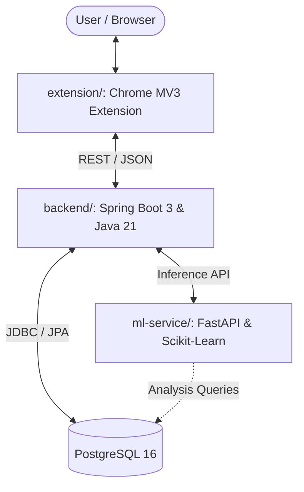

# Shadow Sentinel Architecture

Shadow Sentinel is a multi-tier security and monitoring monorepo consisting of:

## Components

### 1. `extension/` (Client)
- Chrome Manifest V3 extension.
- Built using vanilla JavaScript, HTML, and CSS (no bundler / build step required).
- Interacts with the user's active session and communicates with the backend service.

### 2. `backend/` (Core API & Orchestrator)
- Java 21 and Spring Boot 3.x.
- Managed with Maven.
- Core responsibilities: User authentication (Spring Security), persistence (Spring Data JPA), validation, and integration with the ML service.

### 3. `ml-service/` (Analytics & Machine Learning)
- Python 3.11 + FastAPI + Scikit-Learn.
- Handles feature extraction, model inference, anomaly detection, and data processing.

### 4. Infrastructure
- PostgreSQL 16 container managed via `docker-compose.yml`.
- Configured with environment variables via `.env`.
